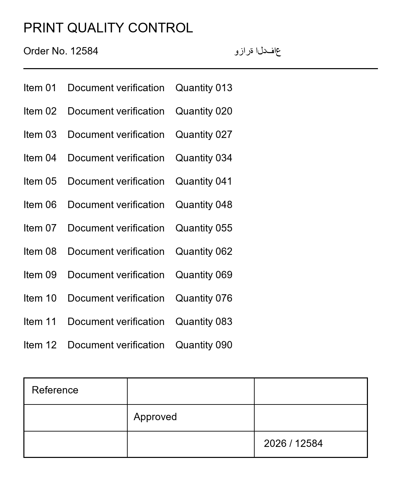
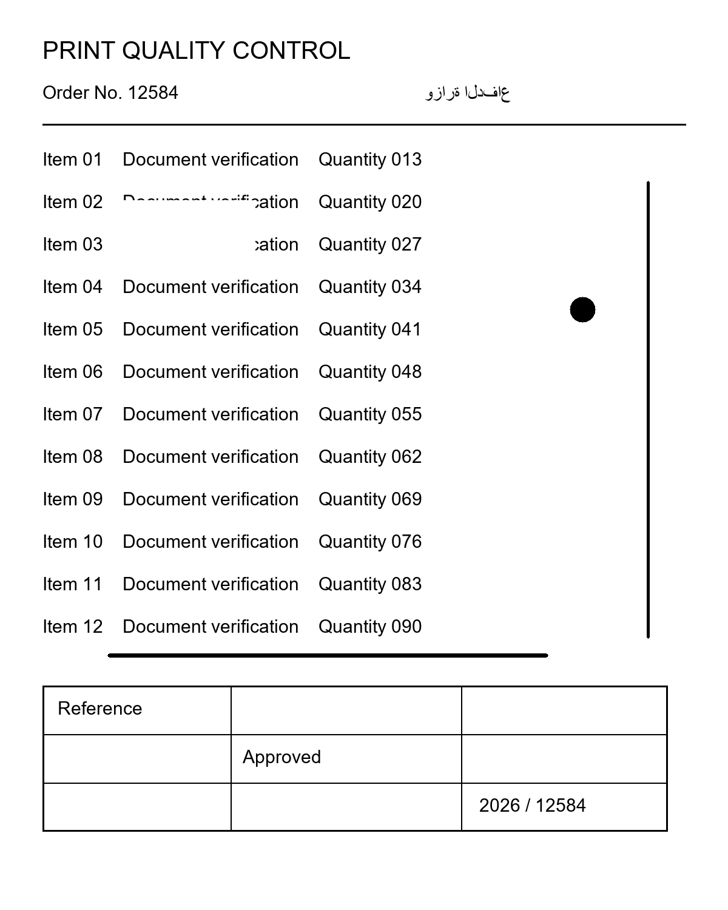

# Print Defect Inspection System

A Windows desktop application for comparing printed or scanned documents against a reference image. It highlights potential printing defects, including extra ink, missing ink, faint smudges, streaks, and marks near page edges and corners.

The application supports batch inspection, interactive defect markers, portable inspection files, and CSV/JSON reports. **OCR is optional and disabled by default**, so visual inspection can run without installing OCR engines or downloading recognition models.

## Features

- **Reference-based comparison:** inspect multiple pages against one approved reference.
- **Automatic alignment:** correct page rotation, skew, scale, and position using feature matching and image registration.
- **Full-page inspection:** retain scan margins and corner marks that extend beyond the reference canvas.
- **Visual defect detection:** combine structural similarity, extra/missing ink analysis, streak detection, and blob detection.
- **Faint ink detection:** identify meaningful intensity changes on blank paper, including marks above the binary ink threshold.
- **Optional text comparison:** enable OCR to compare recognized content and inspect text differences and confidence.
- **Interactive results:** select errors from a table or image, zoom to their locations, and inspect diagnostic masks.
- **Batch processing:** follow progress in a dedicated live inspection window and cancel after the current sample.
- **Portable results:** save and reopen `.pinspect` inspections without rerunning analysis.
- **PDF conversion:** export PDF pages to PNG before inspection.
- **Local processing:** document comparison runs locally; OCR uses locally installed models when enabled.

## Example documents

These synthetic samples demonstrate the reference-and-sample workflow; they are not an accuracy benchmark.

| Reference document | Sample with simulated defects |
| --- | --- |
|  |  |

## Technology

| Component | Implementation |
| --- | --- |
| Desktop interface | Python and PySide6 / Qt |
| Alignment and ink analysis | OpenCV and NumPy |
| Structural comparison | scikit-image SSIM |
| Image loading | Pillow |
| PDF rendering | PyMuPDF |
| Optional final text recognition | PaddleOCR in a separate Python environment |
| Optional text-orientation probes | Tesseract through pytesseract |
| Reports and saved sessions | JSON, CSV, and `.pinspect` archives |

## Getting started

The application has been developed and tested on **Windows with Python 3.14**. Commands below use PowerShell and should be run from the repository root after cloning or downloading it.

### 1. Create the application environment

```powershell
py -3.14 -m venv print-defect
.\print-defect\Scripts\python.exe -m pip install --upgrade pip
.\print-defect\Scripts\python.exe -m pip install -r requirements.txt
```

Using the environment's Python executable directly avoids the need to activate it.

### 2. Configure the application

For a new checkout, copy the example configuration:

```powershell
Copy-Item settings.example.json settings.json
```

Skip this step if you already have a configuration you want to keep. The application also runs with built-in defaults when `settings.json` is absent.

Leave `ocr_enabled` set to `false` to start with visual inspection. The Tesseract executable, its language files, and PaddleOCR models are not required in this mode. The Python dependencies in `requirements.txt` are still required.

### 3. Launch

```powershell
.\print-defect\Scripts\python.exe app.py
```

## Using the application

1. Click **Change reference** and select the approved reference image.
2. Use **Add images** or **Add folder** to select printed samples. Folder selection reads supported images directly inside that folder.
3. Review the previews. Use the rotation controls or **Text direction...** for manual orientation corrections when needed.
4. Choose **OCR: OFF** for visual inspection or **OCR: ON** for additional text recognition. The toggle saves your preference and is locked while inspection runs.
5. Click **Start inspection** and follow the live progress.
6. In the results window, select an error to highlight it, then use **Zoom to selected error** for a closer look.
7. Switch between the aligned sample, original sample, reference, difference mask, extra ink, missing ink, and other diagnostic views.
8. Use **Save inspection**, **Export CSV**, or **Export JSON report** to retain the results. Reopen portable files with **Open saved inspection**.

Supported image formats are PNG, JPG/JPEG, BMP, and single-page TIF/TIFF. EXIF orientation is applied when loading images. Use **PDF to PNG** to convert PDF documents into individual page images.

## Optional OCR setup

Visual inspection and text recognition are separate checks. With OCR off, the reference's supplied orientation defines the comparison frame, and printed pages are matched to it using feature geometry.

With OCR on, the application uses:

- **PaddleOCR** for final text recognition, currently configured with an Arabic recognition model.
- **Tesseract** for text-orientation detection when needed, using `ara+eng` by default.

### PaddleOCR environment

Install the pinned OCR dependencies in a separate **Python 3.11** environment. Do not install them into the main application's Python 3.14 environment.

```powershell
py -3.11 -m venv "$env:USERPROFILE\.na3em_ocr_benchmark\paddle"
& "$env:USERPROFILE\.na3em_ocr_benchmark\paddle\Scripts\python.exe" -m pip install -r requirements-paddle.txt
```

The worker expects these locally provisioned model directories beneath the configured `paddle_model_dir`:

```text
<model-directory>/
  PP-OCRv6_medium_det/
    inference.json
    inference.pdiparams
    inference.yml
  arabic_PP-OCRv5_mobile_rec/
    inference.json
    inference.pdiparams
    inference.yml
```

Installing the Python packages alone does not provision these model files. Set **PaddleOCR Python executable** and **PaddleOCR local models** in Settings to the locations on your machine. The worker validates the pinned package versions and required model files before recognition.

### Tesseract orientation support

Install the Tesseract executable separately and provide `ara.traineddata` and `eng.traineddata` in its language-data directory. `osd.traineddata` is optional. Set the executable and tessdata paths in Settings; installing `pytesseract` alone does not install Tesseract.

To check the configured Tesseract installation:

```powershell
.\print-defect\Scripts\python.exe app.py --diagnose
```

This command validates Tesseract and its requested language data; it does **not** validate PaddleOCR. Once both OCR components are configured, enable **OCR: ON** in the setup window.

## How inspection works

```text
Reference image + printed samples
               |
        Load and orient pages
               |
       Register each sample
               |
   Preserve the full comparison canvas
               |
   +-----------+------------+----------------+
   |                        |                |
Structural / ink       Streak / blob     Optional OCR
  comparison             detection      and text comparison
   |                        |                |
   +------------------------+----------------+
                            |
                  Merge defect evidence
                            |
                Display and save results
```

The reference's features and preprocessing are cached across a batch. Registration uses ORB feature matching and RANSAC, with an ECC affine fallback. Visual detectors run independently so one failed check does not discard evidence from successful checks.

Low page coverage requires review, but detectable regions are still inspected. Failed registration skips pixel comparisons because the images cannot be compared reliably.

### Understanding results

| Display state | Meaning |
| --- | --- |
| **Passed** | Required checks completed, with no detected defects or threshold failures. With OCR off, this covers visual checks only. |
| **Defective** | Inspection completed and found localized defects or out-of-range metrics. |
| **Review required** | Inspection is incomplete or uncertain, for example due to low coverage, unresolved orientation, or failed/low-confidence enabled OCR. |
| **Failed** | A processing error prevented inspection from completing. |

The underlying engine reports `PASS` or `DEFECTIVE`, alongside completion status and decision reasons. An incomplete `DEFECTIVE` result does not by itself confirm a physical printing defect.

## Configuration

Use **Settings** for common options. Additional options and validation rules are defined in [config.py](config.py). Store local overrides in `settings.json`; an example is included in [settings.example.json](settings.example.json).

| Setting | Default | Purpose |
| --- | --- | --- |
| `ocr_enabled` | `false` | Enable or disable optional OCR checks |
| `auto_orientation` | `true` | Resolve page orientation automatically |
| `ssim_threshold` | `0.95` | Minimum aggregate structural similarity |
| `extra_ink_threshold` | `0.002` | Maximum extra-ink ratio |
| `missing_ink_threshold` | `0.002` | Maximum missing-ink ratio |
| `min_defect_area` | `40` | Minimum connected defect area in comparison pixels |
| `registration_tolerance` | `1` | Pixel tolerance around existing ink |
| `intensity_difference` | `35` | Minimum meaningful grayscale difference |
| `min_coverage` | `0.95` | Required reference coverage for a complete inspection |

Thresholds are starting values and should be calibrated using representative clean and defective scans. Localized defects can fail inspection even when aggregate ratios remain below their thresholds.

## Command-line tools

Use the application's Python environment for these commands.

Generate synthetic demonstration images:

```powershell
.\print-defect\Scripts\python.exe tools\create_test_defects.py --demo
```

Inspect selected images:

```powershell
.\print-defect\Scripts\python.exe tools\inspect_batch.py --reference samples\standard.png --images samples\printed_clean.png samples\printed_defective.png
```

Inspect every supported image directly inside a folder:

```powershell
.\print-defect\Scripts\python.exe tools\inspect_batch.py --reference samples\standard.png --folder samples
```

The batch runner uses `settings.json`, including the OCR setting. It returns exit code `0` when every inspection is complete and `2` when at least one is incomplete; completion does not mean every sample passed.

Convert a PDF to PNG pages:

```powershell
.\print-defect\Scripts\python.exe pdf_to_images.py document.pdf --dpi 200
```

The converter creates a folder beside the PDF and refuses to overwrite existing page images.

## Saved outputs

Each batch creates a uniquely named directory under `outputs/` by default:

```text
outputs/batch_<timestamp>_<id>/
  page_<filename>_<id>/
    original_printed.png
    normalized_printed.png
    normalized_reference.png
    aligned_printed.png
    valid_comparison_mask.png
    difference_mask.png
    extra_ink_mask.png
    missing_ink_mask.png
    detected_lines.png
    defect_overlay.png
    report.json
  batch_report.json
  batch_report.csv
```

Reports include check statuses, decision reasons, defect coordinates, alignment evidence, metrics, processing times, settings, and OCR results when enabled. Comparison images and defect markers share a full-page coordinate frame; reference padding and transformation metadata are retained in the report.

Portable `.pinspect` files package inspection data and images for reopening through the desktop application. Runtime logs are written to `logs/inspection.log`.

## Project structure

```text
app.py                    Desktop entry point and diagnostics
config.py                 Settings, defaults, and validation
pdf_to_images.py          PDF-to-PNG converter
gui/                      Setup, live inspection, results, and image viewers
src/                      Alignment, detection, OCR, reporting, and archives
tools/                    Batch runner, sample generation, and verification tools
tests/                    Automated backend, GUI, and archive tests
samples/                  Synthetic demonstration images
requirements.txt          Main application dependencies
requirements-paddle.txt   Optional isolated OCR dependencies
settings.example.json     Example local configuration
```

## Tests and validation

Run the automated tests:

```powershell
.\print-defect\Scripts\python.exe -m unittest discover -s tests -v
```

Tests cover alignment, orientation, corner and faint-ink detection, optional OCR, text comparison, GUI workflows, and portable archives. OCR fixtures are mocked where deterministic behavior is needed; live checks depend on installed runtimes and models.

See [Visual Mode Validation](VISUAL_MODE_VALIDATION.md) for the recorded 54-page comparison. That local run measured approximately **2.5 seconds per page at the median**, with OCR off. Timing depends on image size, hardware, settings, and output storage. Generated output links in validation notes are local artifacts and may not be included in a GitHub checkout.

## Limitations and troubleshooting

- **Unexpected markers:** scan noise, paper texture, compression, and small registration differences can produce findings. Inspect diagnostic masks and calibrate thresholds on labeled examples.
- **Missed small defects:** minimum-area filtering and registration tolerance can suppress tiny marks. Lowering these settings can also increase noise.
- **Incorrect orientation or failed alignment:** verify that the sample matches the reference layout and use manual rotation when necessary. Sparse, blank, cropped, or repetitive pages may require review.
- **Page margins:** areas outside the reference use white background. Use full-page references on white paper; cropped references and colored paper need additional review.
- **OCR errors:** inspect the configured executable/model paths, recognition confidence, and reported errors. Keep OCR off when only visual inspection is needed.
- **Output errors:** choose a writable output directory and inspect the application log.

This project is a prototype for evaluating print inspection workflows. Detection thresholds and OCR confidence are not guarantees of accuracy or calibrated production acceptance criteria.
